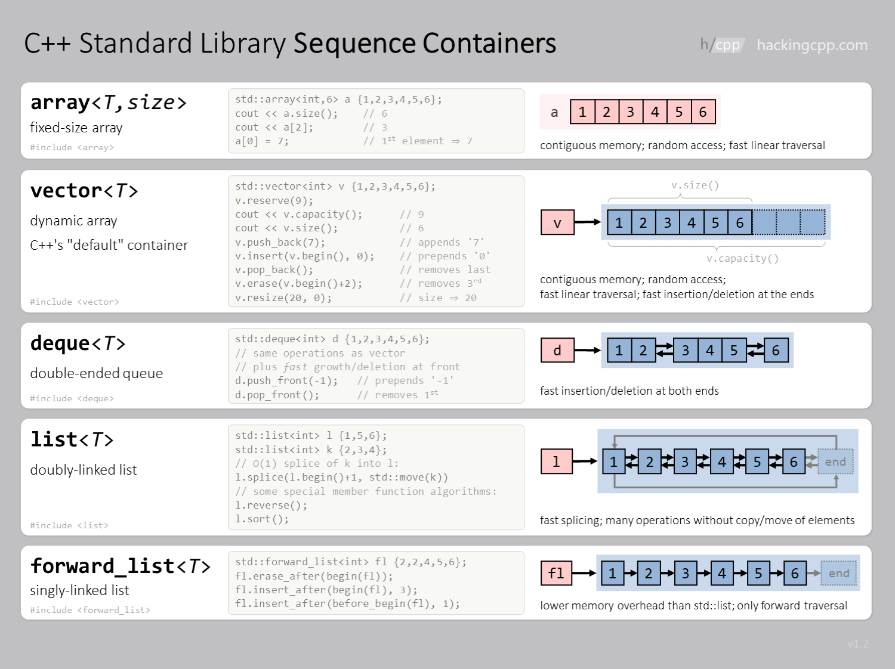

< [back](cpp08_00_learning.md)| [main](/) | [forward](cpp08_02_00_Container_Assoziativ.md) > 

---

# Sequential Containers
## [std::vector](cpp08_01_01_Vectoren.md) 
- Type of dynamic array with a memory block
### Advantages
- Dynamic resizing in relation to the end. 
- Fast random access time complexity `O(1)`
## Disadvantages  
- Elements inserted at the beginning or in the middle require `O(n)` copy instructions and are therefore very expensive.

## [std::deque](cpp08_01_02_deque.md)
- Type of dynamic array with multiple memory blocks
### Advantages:
- **Fast insertion** and removal at both the beginning and the end.
- Random access to elements, similar to `vector`.
### Disadvantages 
- Since it consists of multiple memory blocks -> overhead -> higher memory usage.

## [std::list](cpp08_01_03_list.md)
- Doubly linked list 
### Advantages 
- **Efficient insertion and deletion** at any position (O(1)).
- Ideal for deletion and insertion within the list. 
### Disadvantages 
- Due to many memory blocks -> overhead -> higher memory usage.
- No fast access like in `array`, `vector`, `deque`.

## [std::array (since C++11)](cpp08_01_04_array)
- Static version of the array
### Advantages 
- Efficient memory since size must be known at compile time.
### Disadvantages
- No dynamic resizing possible.

## [std::forward_list (since C++11)](cpp08_01_05_forward_list.md)
- Singly linked list
### Advantages 
- Less memory usage than `list`.
- Efficient insertion of an element into the list `O(1)`.
### Disadvantages
- Directionally bound.
- No random access to elements.

## [std::stack](cpp08_01_06_stack.md)
Uses other sequential containers like `vector`, `list`, `set` and is based on the **LIFO** principle. By default, no iterators are available.  

---
## Overview

