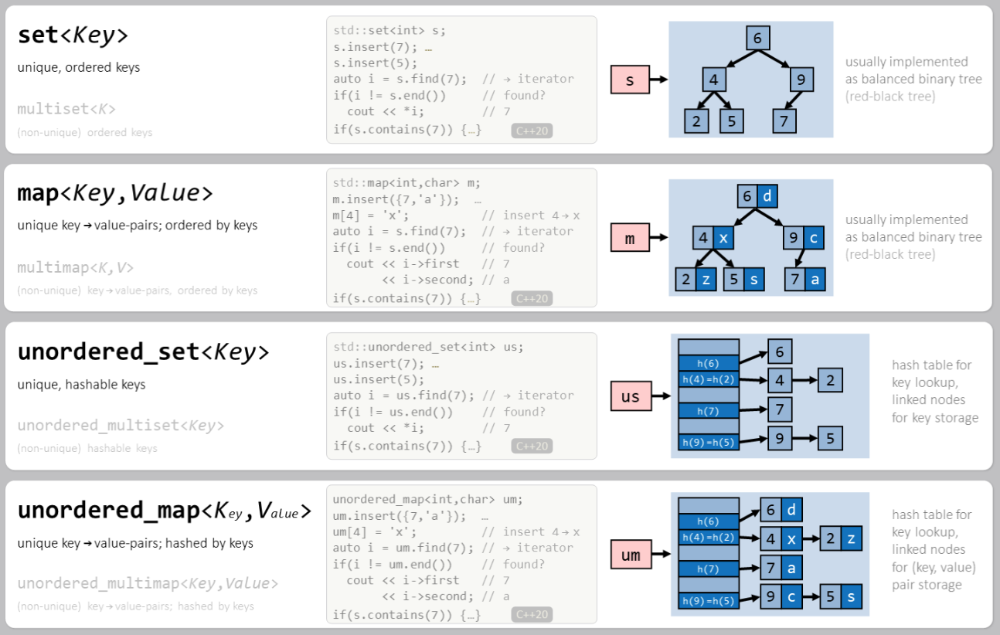

< [back](cpp08_02_00_Container_Assoziativ.md) | [main](/) | [forward](cpp08_04_Algoritmen.md) >

# Container `unordered`
In addition to `set`, `multiset`, `map`, and `multimap`, there are also unordered versions that have the same settings as the associative containers but are unsorted and included differently.

## std::unordered_set
### Include 
```cpp
#include <unordered_set>
```
- See [set](cpp08_02_01_set.md)

## std::unordered_multiset
### Include 
```cpp
#include <unordered_set>
```
- See [set](cpp08_02_01_set.md)

## std::unordered_map
### Include 
```cpp
#include <unordered_map>
```
- See [map](cpp08_02_02_set.md)

## std::unordered_multimap
### Include 
```cpp
#include <unordered_map>
```
- See [map](cpp08_02_02_set.md)

---

